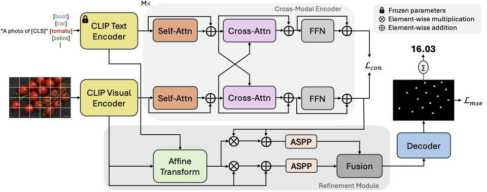
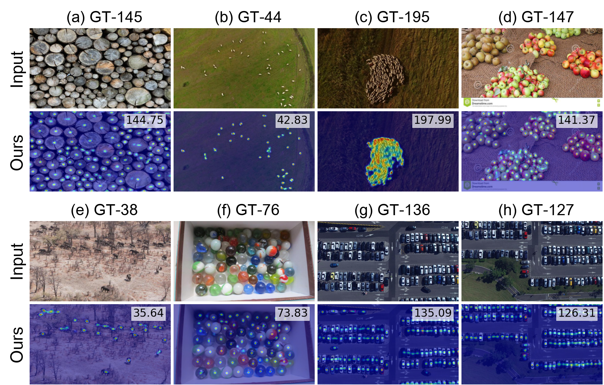

# Vision-Language Feature Refinement for Zero-Shot Object Counting  
[](https://ieeexplore.ieee.org/document/10785495)  
[](https://drive.google.com/file/d/1TFptlGLVz50RDIhxHkd5t7udxOn3Wokj/view)

### What's Inside  
- [Model Overview](#model-overview)
- [Setup Instructions](#get-started)
- [Code Execution](#run-the-model)  
- [Performance](#model-performance)  
- [Acknowledgements](#reference)  

---

## Model Overview



The proposed VLC model addresses the **zero-shot object counting task**. The **input image** and **text prompts** are first processed by the **CLIP encoders**. A **cross-modal encoder** then learns joint representations optimized by aligning **text features** with **positive patch-level visual features** to capture contextually relevant information. The **refinement module** enhances visual feature sets using: Affine transformation, and Atrous Spatial Pyramid Pooling (ASPP) for multi-scale contextual features. The fusion module then adaptively combines the feature sets. Finally, the decoder generates a density map to predict object counts.


## Get Started  
### 📂 Download Your Datasets  
**Essential datasets for the project:**  
- [FSC147](https://github.com/cvlab-stonybrook/LearningToCountEverything): Diverse object counting scenarios  
- [CARPK](https://lafi.github.io/LPN/): Aerial vehicle counting (used via Hub package - [details here](https://datasets.activeloop.ai/docs/ml/datasets/carpk-dataset/))  

**Folder Structure**  
```text
/
├─VLC/
├─FSC147/
│  ├─gt/            # Ground truth data
│  ├─image/         # Image files
│  ├─ImageClasses_FSC147.txt
│  ├─Train_Test_Val_FSC_147.json
│  ├─annotation_FSC147_384.json
```

### 🛠️ Setup Your Environment
**1. Install Core Packages**
```bash
# PyTorch with CUDA 11.1
pip install torch==1.10.0+cu111 torchvision==0.11.0+cu111 torchaudio==0.10.0 -f https://download.pytorch.org/whl/torch_stable.html

# Project dependencies
pip install -r requirements.txt
pip install hub
```

**2. Get Pretrained CLIP Weights and BPE File**

You will need to download the following files:

- [CLIP Pretrained Weight](https://openaipublic.azureedge.net/clip/models/5806e77cd80f8b59890b7e101eabd078d9fb84e6937f9e85e4ecb61988df416f/ViT-B-16.pt)
- [BPE File](https://github.com/openai/CLIP/blob/main/clip/bpe_simple_vocab_16e6.txt.gz)

Place the files in the appropriate folders:
- **CLIP weight**: Place it under the `pretrain` folder.
- **BPE file**: Place it under the `tools/dataset` folder.

## Run the Model
### 🚀 Train Your Counter

```bash
bash scripts/train.sh FSC {gpu_id} {exp_number}
```
Configure options in ```train.sh``` before running

### 📊 Test the Results

```bash
bash scripts/test.sh FSC {gpu_id} {exp_number}
```
Specify weights using ```--ckpt_used``` in test.sh

   
## Model Performance

| **Dataset**  | **MAE** | **RMSE** |
|--------------|---------|----------|
| **FSC-val**  | 16.08   | 62.28   |
| **FSC-test** | 13.57   | 100.79  |
| **CARPK**    | 5.91    | 7.47    |

## 🎨 Qualitative Results

**Qualitative results on FSC-147 (a-f) and CARPK (g-h). GT denotes ground-truth count.**  

<p align="center">
  
</p>

## Reference
[CounTR](https://github.com/Verg-Avesta/CounTR) and [VLCounter](https://github.com/Seunggu0305/VLCounter).
